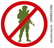

```{r setup}
knitr::opts_chunk$set(echo = TRUE)

library(tidyverse)
library(gridExtra)
library(readr)
library(ggmap)
library(ggrepel)
library(rworldmap)
library(leaflet)
library(leaflet.extras)
library(rgdal)
library(rworldxtra)
library(plotly)
library(htmlwidgets)
library(htmltools)
```

Import data
Clean up the spaca. Import 1st cleaned Global Terrorist Data Set aggred by the group from C:\Users\kelly chan\UniOfSyd\S2_2018\Visual Analytics\Assignment 2\Global Terrorism

```{r}
rm(list=ls())
df <- read.csv('/Users/kelly chan/UniOfSyd/S2_2018/Visual Analytics/Assignment 2/Global Terrorism/terrorism_cleaned_KC.csv')
#setwd("/Users/kelly chan/UniOfSyd/S2_2018/Visual Analytics/Assignment 2/Global Terrorism")

```

## Create & simplfy data frame with new generated field - decades to group the years period

```{r}
df1 <- df %>% 
  select(counter, iyear, country_txt, city,region,region_txt, latitude,longitude,attacktype1, attacktype1_txt, targtype1_txt) %>%
  filter (attacktype1 != 9)

df1 <- df1 %>%
  mutate(decade = 
           ifelse(iyear < 1980, "1970s",
                   ifelse(iyear < 1990, "1980s",
                          ifelse(iyear < 2000, "1990s",
                                 ifelse(iyear <2010, "2000s", "2010s")))))

df1 <- df1 %>%
  mutate(Region_group = ifelse(region < 4, "America Region",
     ifelse((region > 3) & (region < 8), "Asia Region",
       ifelse((region > 7) & (region < 10), "Europe Region", 
         ifelse((region > 9) & (region < 12), "Africa Region",
                                        "Australasia & Oceania Region")))))

```

## Prepare map title tage to HTML widget and custom icon and legend setup

```{r}
# Map Title style
tag.map.title <- tags$style(HTML("
  .leaflet-control.map-title { 
    transform: translate(-50%,20%);
    position: fixed !important;
    left: 80%;
    text-align: center;
    padding-left: 10px; 
    padding-right: 10px; 
    background: rgba(255,255,255,0.75);
    font-weight: bold;
    font-size: 16px;
  }
"))

# Custome legend list and style
html_legend <- "<b>Attack Type</b></br>  Armed Assault<br/>
  Assassination<br/>    Hostage Taking (Barricade)<br/>   Bombing<br/>   Hijacking<br/>   Facility/Infrastructure Attack <br/>   Hostage Taking (Kidnapping)<br/>   Unarmed Assault<br/>"


```


## Create Overview map

```{r,fig.width=10, fig.height=6}
# Set map title in HTML Widget
title <- tags$div(
  tag.map.title, HTML("Global Terrorism Worldmap (1970-2017)")
) 
setwd("/Users/kelly chan/UniOfSyd/S2_2018/Visual Analytics/Assignment 2/GTA") 
Leg <- data.frame(region=c("Greater America", "Greater Asia", "Greater Europe", "Africa & Middle East", "Australasia & Oceania Region"),
                   colour = c("green", "navy", "orange","purple", "yellow"))
Ter_map_o <- df1 %>%
  leaflet(options = leafletOptions(maxZoom = 2, minZoom = 2)) %>%
  addTiles() %>%
  setView(lng = -10, lat =20, zoom = 2) %>%
  addMarkers(~longitude, ~latitude, options = markerOptions(interactive = FALSE, clickable = NULL), clusterOptions = markerClusterOptions(freezeAtZoom = FALSE,showCoverageOnHover = FALSE, zoomToBoundsOnClick = FALSE, spiderfyOnMaxZoom = FALSE)) %>%
  addCircles(-95, 10, weight = 1, radius = 7500000, color="green" ,popup = "<a href='file:///C:/Users/kelly chan/UniOfSyd/S2_2018/Visual Analytics/Assignment 2/GTA/GTM_AMR.html'>Greater America Region</a>")%>%
  addCircles(110, 22, weight = 1, radius = 3900000, color="navy" ,popup = "<a href='file:///C:/Users/kelly chan/UniOfSyd/S2_2018/Visual Analytics/Assignment 2/GTA/GTM_ASIA.html'>Greater Asia Region</a>")%>%
  addCircles(60, 70, weight = 1, radius = 3400000, color="orange" ,popup = "<a href='file:///C:/Users/kelly chan/UniOfSyd/S2_2018/Visual Analytics/Assignment 2/GTA/GTM_EU.html'>Greater Europe Region</a>")%>%
  addCircles(20, 0, weight = 1, radius = 4800000, color="purple" ,popup = "<a href='file:///C:/Users/kelly chan/UniOfSyd/S2_2018/Visual Analytics/Assignment 2/GTA/GTM_ARF.html'>Africa & Middle East Region</a>")%>%
  addCircles(140, -31, weight = 1, radius = 3100000,  color="yellow" ,popup = "<a href='file:///C:/Users/kelly chan/UniOfSyd/S2_2018/Visual Analytics/Assignment 2/GTA/GTM_AOC.html'>Australasia & Oceania Region", labelOptions(noHide=TRUE))%>%
  addLegend("bottomleft", colors = Leg$colour, labels = Leg$region , title="Region Groups") %>%
  setMaxBounds(-155, 64, 150, -45) %>%
  addControl(title, position = "topleft", className="map-title") 
Ter_map_o

saveWidget(Ter_map_o, file="GTM_All.html")

```            

## Visualise attack by region --- Australasia & Oceania Region

```{r,fig.width=20, fig.height=8} 
#Select Australasia & Oceania Region data and remove rows with attack type = unknown
r12 <- df1 %>%
  filter((region == 12) & (attacktype1 != 9)) %>%   
  select(counter, iyear, country_txt, city, latitude,longitude,attacktype1, attacktype1_txt, targtype1_txt)
  
setwd("/Users/kelly chan/UniOfSyd/S2_2018/Visual Analytics/Assignment 2/GTA") 
AT_icons <- iconList(
  arm = makeIcon(iconUrl = "./arm.png", "arm24.png",36,36 ),
  ass = makeIcon(iconUrl = "./ass.png", "ass24.png",36,36 ),
  bar = makeIcon(iconUrl = "./bar.png", "bar24.png",36,36 ),
  bom = makeIcon(iconUrl = "./bombing.png", "bombing24.png",36,36 ),
  hij = makeIcon(iconUrl = "./hij.png", "hij24.png",36,36 ),
  inf = makeIcon(iconUrl = "./inf.png", ".inf24.png", 36,36 ),
  kic = makeIcon(iconUrl = "./kic.png", "kic24.png",36,36 ),
  una = makeIcon(iconUrl = "./una.png", "una24.png",36,36 )
)

# Map icon by attack type
r12 <- r12 %>% cbind(r12, 
  data.frame(type=factor(
           ifelse(r12$attacktype1 == 1, "ass",
                  ifelse(r12$attacktype1 == 2, "arm",
                         ifelse(r12$attacktype1 == 3, "bom",
                                ifelse(r12$attacktype1 == 4, "hij",
                                       ifelse(r12$attacktype1 == 5, "bar",
                                              ifelse(r12$attacktype1 == 6, "kic",
                                                     ifelse(r12$attacktype1 == 7,"inf", "una"))))))))))

# Set map title in HTML Widget
title <- tags$div(
  tag.map.title, HTML("Australasia & Oceania Region Terrorism Status")
) 
#


#style='width:36px;height:36px;
# Focus on the region, place icon and title then display the map
Ter_map <- r12 %>%
  leaflet() %>%
  addTiles() %>%
  #setView(lng = 170.366667, lat = -16.433333, zoom = 2.5) %>%
  setView(lng = 125, lat = -17, zoom = 2.5) %>%
  addMarkers(~longitude, ~latitude,popup = paste("City:", r12$city, "<br>","Year:", r12$iyear, "<br>", "Attack Type:", r12$attacktype1_txt), clusterOptions = markerClusterOptions(), icon = ~AT_icons[type]) %>%
  fitBounds(125, -10, 150, -45) %>%
  addControl(title, position = "topleft", className="map-title") %>%
  addControl(html = html_legend, position = "topleft")
Ter_map
saveWidget(Ter_map, file="GTM_AOC.html")
```

## Visualise attack by region --- Greater America Region


```{r, fig.width=20, fig.height=8}
# Set map title in HTML Widget
title <- tags$div(
  tag.map.title, HTML("Greater America Region Terrorism Status")
)  

# Select America Region data and remove rows with attack type = unknown
r1 <- df1 %>%
  filter((region < 4) & (attacktype1 != 9)) %>%
  select(counter, iyear, country_txt, city, latitude,longitude,attacktype1, attacktype1_txt, targtype1_txt)

setwd("/Users/kelly chan/UniOfSyd/S2_2018/Visual Analytics/Assignment 2/GTA") 

AT_icons <- iconList(
  arm = makeIcon(iconUrl = "./arm.png", "arm24.png",36,36 ),
  ass = makeIcon(iconUrl = "./ass.png", "ass24.png",36,36 ),
  bar = makeIcon(iconUrl = "./bar.png", "bar24.png",36,36 ),
  bom = makeIcon(iconUrl = "./bombing.png", "bombing24.png",36,36 ),
  hij = makeIcon(iconUrl = "./hij.png", "hij24.png",36,36 ),
  inf = makeIcon(iconUrl = "./inf.png", ".inf24.png", 36,36 ),
  kic = makeIcon(iconUrl = "./kic.png", "kic24.png",36,36 ),
  una = makeIcon(iconUrl = "./una.png", "una24.png",36,36 )
)

# Map icon by attack type
r1 <- r1 %>% cbind(r1, 
  data.frame(type=factor(
           ifelse(r1$attacktype1 == 1, "ass",
                  ifelse(r1$attacktype1 == 2, "arm",
                         ifelse(r1$attacktype1 == 3, "bom",
                                ifelse(r1$attacktype1 == 4, "hij",
                                       ifelse(r1$attacktype1 == 5, "bar",
                                              ifelse(r1$attacktype1 == 6, "kic",
                                                     ifelse(r1$attacktype1 == 7,"inf", "una"))))))))))

# Focus on the region, place icon and title then display the map
Ter_map <- r1 %>%
  leaflet() %>%
  addTiles() %>%
  setView(lng = -99.086624, lat = 19.371887, zoom = 2) %>%
  addMarkers(~longitude, ~latitude,popup = paste("City:", r1$city, "<br>","Year:", r1$iyear, "<br>", "Attack Type:", r1$attacktype1_txt),clusterOptions = markerClusterOptions(),icon = ~AT_icons[type]) %>%
  fitBounds(-155, 64, -37, -54) %>%
  addControl(title, position = "topleft", className="map-title") %>%
  addControl(html = html_legend, position = "topleft")
Ter_map
saveWidget(Ter_map, file="GTM_AMR.html")
```

## Visualise attack by region --- Asia Region

```{r, fig.width=20, fig.height=10}
# Set map title in HTML Widget
title <- tags$div(
  tag.map.title, HTML("Greater Asia Region Terrorism Status")
)  

# Select Asia Region data and remove rows with attack type = unknown
r4 <- df1 %>%
  filter((region > 3) & (region < 8) & (attacktype1 != 9)) %>% 
  select(counter, iyear, country_txt, city, latitude,longitude, attacktype1, attacktype1_txt, targtype1_txt)
setwd("/Users/kelly chan/UniOfSyd/S2_2018/Visual Analytics/Assignment 2/GTA")  
AT_icons <- iconList(
  arm = makeIcon(iconUrl = "./arm.png", "arm24.png",36,36 ),
  ass = makeIcon(iconUrl = "./ass.png", "ass24.png",36,36 ),
  bar = makeIcon(iconUrl = "./bar.png", "bar24.png",36,36 ),
  bom = makeIcon(iconUrl = "./bombing.png", "bombing24.png",36,36 ),
  hij = makeIcon(iconUrl = "./hij.png", "hij24.png",36,36 ),
  inf = makeIcon(iconUrl = "./inf.png", ".inf24.png", 36,36 ),
  kic = makeIcon(iconUrl = "./kic.png", "kic24.png",36,36 ),
  una = makeIcon(iconUrl = "./una.png", "una24.png",36,36 )
)


# Map icon by attack type
r4 <- r4 %>% cbind(r4, 
  data.frame(type=factor(
           ifelse(r4$attacktype1 == 1, "ass",
                  ifelse(r4$attacktype1 == 2, "arm",
                         ifelse(r4$attacktype1 == 3, "bom",
                                ifelse(r4$attacktype1 == 4, "hij",
                                       ifelse(r4$attacktype1 == 5, "bar",
                                              ifelse(r4$attacktype1 == 6, "kic",
                                                     ifelse(r4$attacktype1 == 7,"inf", "una"))))))))))

# Focus on the region, place icon and title then display the map
Ter_map <- r4 %>%
  leaflet() %>%
  addTiles() %>%
  setView(lng = 130.396361, lat = 33.580412, zoom = 2.8) %>%
  addMarkers(~longitude, ~latitude,popup = paste("City:", r4$city, "<br>","Year:", r4$iyear, "<br>", "Attack Type:", r4$attacktype1_txt), clusterOptions = markerClusterOptions(), icon = ~AT_icons[type]) %>%
  fitBounds(35, 64, 140, -8) %>%
  addControl(title, position = "topleft", className="map-title") %>%
  addControl(html = html_legend, position = "topleft")
Ter_map
saveWidget(Ter_map, file="GTM_ASIA.html")
```

## Visualise attack by region --- Greater Europe Region

```{r, fig.width=20, fig.height=8}
title <- tags$div(    #using HTML widget to add title
  tag.map.title, HTML("Greater Europe Region Terrorism Status")
)  

r7 <- df %>%
  filter((region > 7) & (region < 10) & (attacktype1 != 9)) %>%  #select Europe region and remove rows with unknown attack type
  select(counter, iyear, country_txt, city, latitude,longitude, attacktype1, attacktype1_txt, targtype1_txt)

setwd("/Users/kelly chan/UniOfSyd/S2_2018/Visual Analytics/Assignment 2/GTA") 
AT_icons <- iconList(
  arm = makeIcon(iconUrl = "./arm.png", "arm24.png",36,36 ),
  ass = makeIcon(iconUrl = "./ass.png", "ass24.png",36,36 ),
  bar = makeIcon(iconUrl = "./bar.png", "bar24.png",36,36 ),
  bom = makeIcon(iconUrl = "./bombing.png", "bombing24.png",36,36 ),
  hij = makeIcon(iconUrl = "./hij.png", "hij24.png",36,36 ),
  inf = makeIcon(iconUrl = "./inf.png", ".inf24.png", 36,36 ),
  kic = makeIcon(iconUrl = "./kic.png", "kic24.png",36,36 ),
  una = makeIcon(iconUrl = "./una.png", "una24.png",36,36 )
)

# Map icon by attack type
r7 <- r7 %>% cbind(r7, 
  data.frame(type=factor(
           ifelse(r7$attacktype1 == 1, "ass",
                  ifelse(r7$attacktype1 == 2, "arm",
                         ifelse(r7$attacktype1 == 3, "bom",
                                ifelse(r7$attacktype1 == 4, "hij",
                                       ifelse(r7$attacktype1 == 5, "bar",
                                              ifelse(r7$attacktype1 == 6, "kic",
                                                     ifelse(r7$attacktype1 == 7,"inf", "una"))))))))))

# Focus on the region, place icon and title then display the map
Ter_map <- r7 %>%
  leaflet() %>%
  addTiles() %>%
  setView(lng = 37.690605, lat = 49.070703, zoom = 2.2) %>%
  addMarkers(~longitude, ~latitude,popup = paste("City:", r7$city, "<br>","Year:", r7$iyear, "<br>", "Attack Type:", r7$attacktype1_txt), clusterOptions = markerClusterOptions(),icon = ~AT_icons[type]) %>%
  fitBounds(-22, 70, 145, 45) %>%
  addControl(title, position = "topleft", className="map-title") %>%
  addControl(html = html_legend, position = "topleft")
Ter_map
saveWidget(Ter_map, file="GTM_EU.html")
```

## Visualise attack by region --- Africa & Middle East Region

```{r,fig.width=20, fig.height=8}
# Set map title in HTML Widget
title <- tags$div(
  tag.map.title, HTML("Africa & Middle East Region Terrorism Status"))  

# Select Africa data and remove rows with attack type = unknown
r9 <- df %>%
  filter((region > 9) & (region < 12) & (attacktype1 != 9) )%>%
  select(counter, iyear, country_txt, city, latitude,longitude,attacktype1, attacktype1_txt, targtype1_txt)

setwd("/Users/kelly chan/UniOfSyd/S2_2018/Visual Analytics/Assignment 2/GTA") 
AT_icons <- iconList(
  arm = makeIcon(iconUrl = "./arm.png", "arm24.png",36,36 ),
  ass = makeIcon(iconUrl = "./ass.png", "ass24.png",36,36 ),
  bar = makeIcon(iconUrl = "./bar.png", "bar24.png",36,36 ),
  bom = makeIcon(iconUrl = "./bombing.png", "bombing24.png",36,36 ),
  hij = makeIcon(iconUrl = "./hij.png", "hij24.png",36,36 ),
  inf = makeIcon(iconUrl = "./inf.png", ".inf24.png", 36,36 ),
  kic = makeIcon(iconUrl = "./kic.png", "kic24.png",36,36 ),
  una = makeIcon(iconUrl = "./una.png", "una24.png",36,36 ))


# Map icon by attack type
r9 <- r9 %>% cbind(r9, 
  data.frame(type=factor(
           ifelse(r9$attacktype1 == 1, "ass",
                  ifelse(r9$attacktype1 == 2, "arm",
                         ifelse(r9$attacktype1 == 3, "bom",
                                ifelse(r9$attacktype1 == 4, "hij",
                                       ifelse(r9$attacktype1 == 5, "bar",
                                              ifelse(r9$attacktype1 == 6, "kic",
                                                     ifelse(r9$attacktype1 == 7,"inf", "una"))))))))))

# Focus on the region, place icon and title then display the map
Ter_map <- r9 %>%
  leaflet() %>%
  addTiles() %>%
  setView(lng = 51.40519, lat = 35.724533, zoom = 2) %>%
  addMarkers(~longitude, ~latitude,popup = paste("City:", r9$city, "<br>","Year:", r9$iyear, "<br>", "Attack Type:", r9$attacktype1_txt), clusterOptions = markerClusterOptions(), icon = ~AT_icons[type]) %>%
  fitBounds(15, -29, 72, 35) %>%
  addControl(title, position = "topleft", className="map-title") %>%
  addControl(html = html_legend, position = "topleft")
Ter_map
saveWidget(Ter_map, file="GTM_AFR.html")
```

## Visualise terrorist attack type's impacts created to each region

The area graph has given a clear visibility to note attack types were carried to each region. Bombing/Explosion is very frequent terrorist event for eastern Europe, middle east & north Africe. 


```{r, fig.width=20, fig.height=10}
perregion <- df %>% 
  filter(attacktype1 != 9) %>%
  group_by(region_txt,attacktype1_txt) %>% summarise(nIncidents = n())
ggplot(data=perregion) + 
  geom_area(mapping=aes(x=region_txt, y=nIncidents, group=attacktype1_txt, fill=attacktype1_txt), position='fill') +
  theme(axis.text.x = element_text(angle=45, hjust = 1)) +
  labs(x='Region', y='Occurances', fill='Attack Type')
```

   